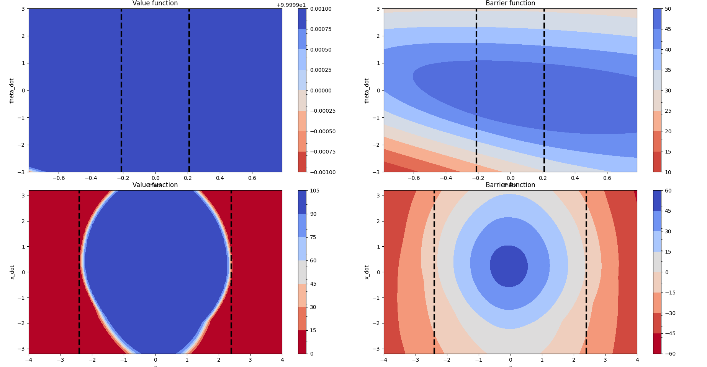
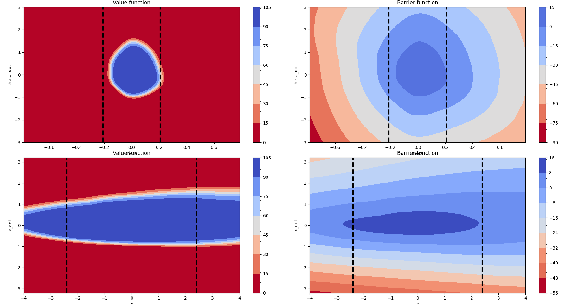
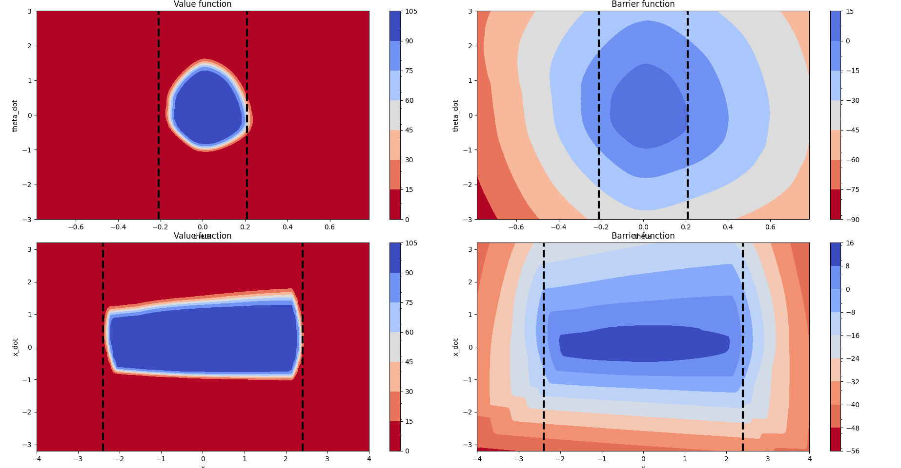

# Composite CBFs

Train 4 checkpoints, 2 x 2-way decompositions of CartPole task
A/B: X threshold / Theta threshold
C/D: Lower / upper bounds on x, theta

```
git checkout 31a695ab3f8142a47102371e8ede82b581ee05a0
bash experiments/decomposed_cartpole.sh
```

## Checkpoints
CartPoleA: (X bounds only) `reports/composite_cbf/checkpoints/tb4ers0e/bump_supervised_2M.pth`

CartPoleB: (Theta bounds only) `reports/composite_cbf/checkpoints/u7453gai/bump_supervised_2M.pth`

CartPoleC: (Negative bounds only) (TODO)

CartPoleD: (Positive bounds only) (TODO)

## Figures

Inspect the individual and combined barrier functions

Individual:



Combined:


## Results

Evaluations on 10 episodes each of DiverseCartPole-v1
CSV results available in `results`

## Videos

`videos/cartpole_a`: CartPoleA checkpoint only
`videos/cartpole_b`: CartPoleB checkpoint only
`videos/cartpole_ab`: CartPoleA + CartPoleB checkpoint, composed

## Reproduction
```
git checkout cc046be25a84ebfacffae81c9eaf7435829a1678

# Evaluate CartPoleA
python rl_cbf/learning/dqn_decomposed_eval.py --model-paths reports/composite_cbf/checkpoints/tb4ers0e/bump_supervised_2M.pth --device cpu --enable-bump-parametrization --video-path cartpole_a

# Evaluate CartPoleB
python rl_cbf/learning/dqn_decomposed_eval.py --model-paths reports/composite_cbf/checkpoints/u7453gai/bump_supervised_2M.pth --device cpu --enable-bump-parametrization --video-path cartpole_b

# Evaluate CartPoleA+B
python rl_cbf/learning/dqn_decomposed_eval.py --model-paths reports/composite_cbf/checkpoints/tb4ers0e/bump_supervised_2M.pth  reports/composite_cbf/checkpoints/u7453gai/bump_supervised_2M.pth --device cpu --enable-bump-parametrization --video-path cartpole_ab
```