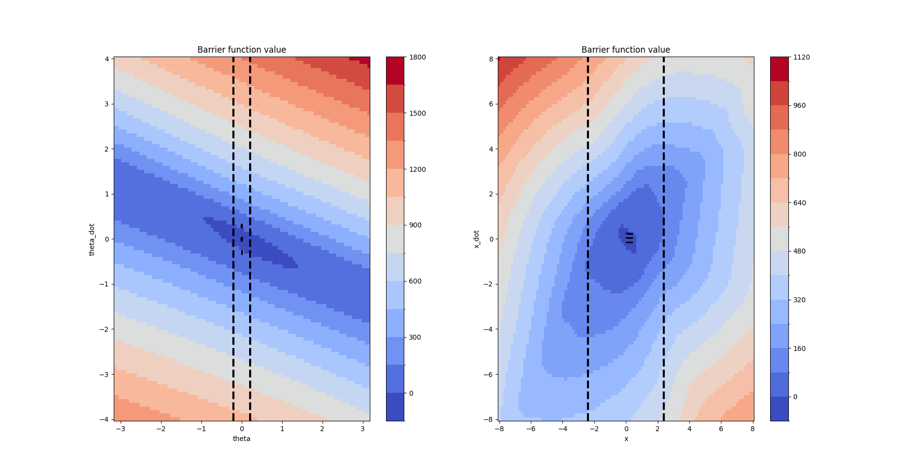
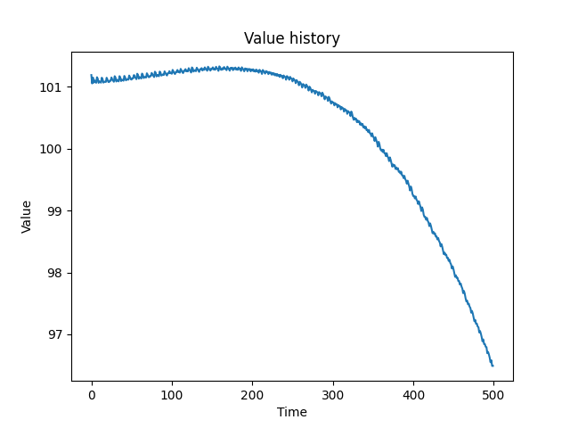
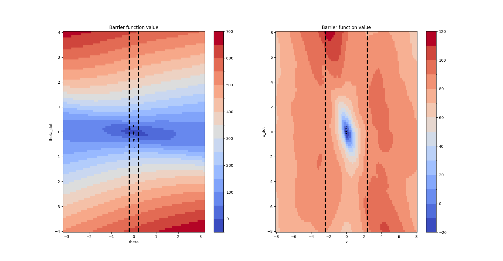
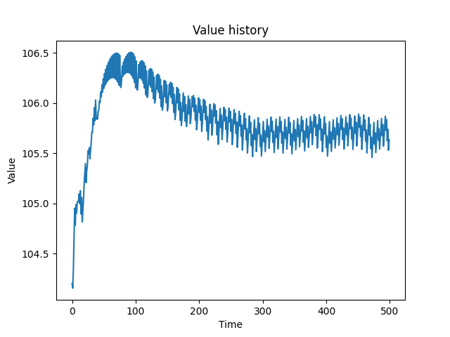
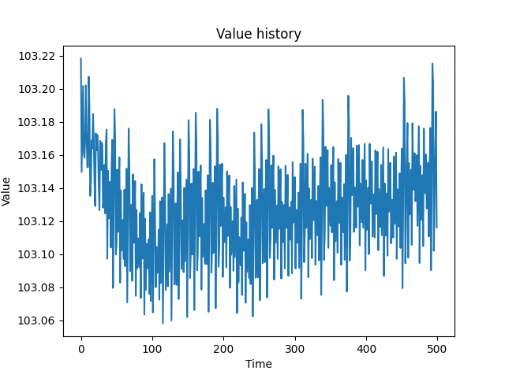
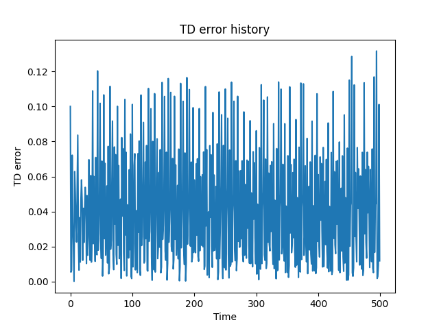
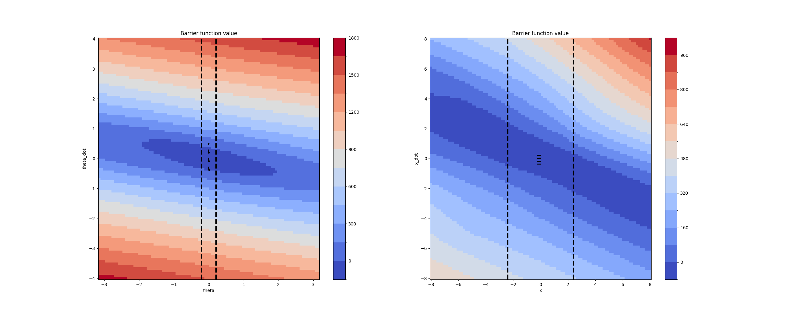
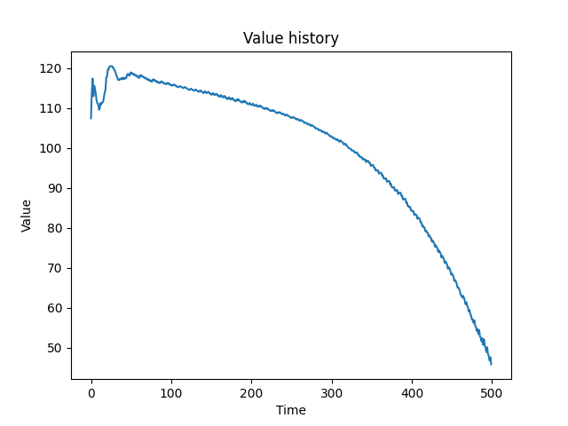
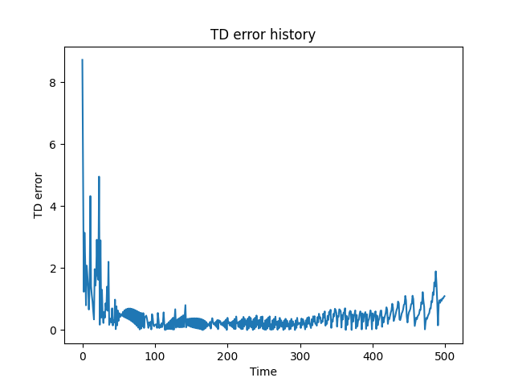
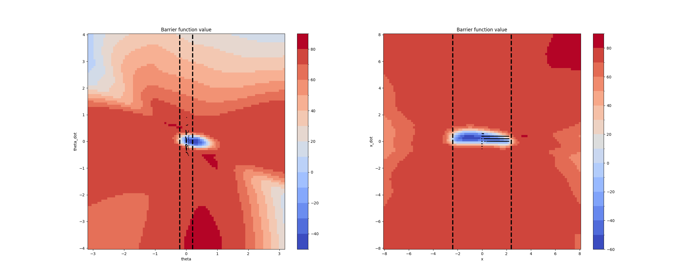

# Supervised Losses

We add a supervised loss on the unsafe states 

The supervised loss has the effect of enforcing the barrier condition

## Figures

We add a supervised loss on the unsafe states 

The supervised loss has the effect of enforcing the barrier condition

We plot:
1. Value trajectory (It should stay high around 100)
2. Barrier function values (The safe states should be accurate)

Compare with and without the supervised loss:

Without:

With:

## Diverse starting locations

Attempted to increase certified safe region by increasing the diversity of starting locations

Plots:
1. Value history
2. TD error history
3. Barrier function

Without anything else:

With supervised loss on unsafe states as well as optimal states:

We observe that adding the supervised loss comes at the cost of increasing the TD error. 
Maybe I can achieve the same effect by simply adding a large negative reward on termination

## Videos

See respective `checkpoints/xxxx/rollout.mp4` 

Checkpoint trained with supervised loss: `vgdae80s`

Checkpoint trained without supervised loss: `yp8twvo`

The checkpoint trained with supervised loss is clearly more stable

Checkpoint trained on DiverseCartPole without supervised losses: `yudtt505`
Checkpoint trained on DiverseCartPole with supervised losses: `fknvr3v5`